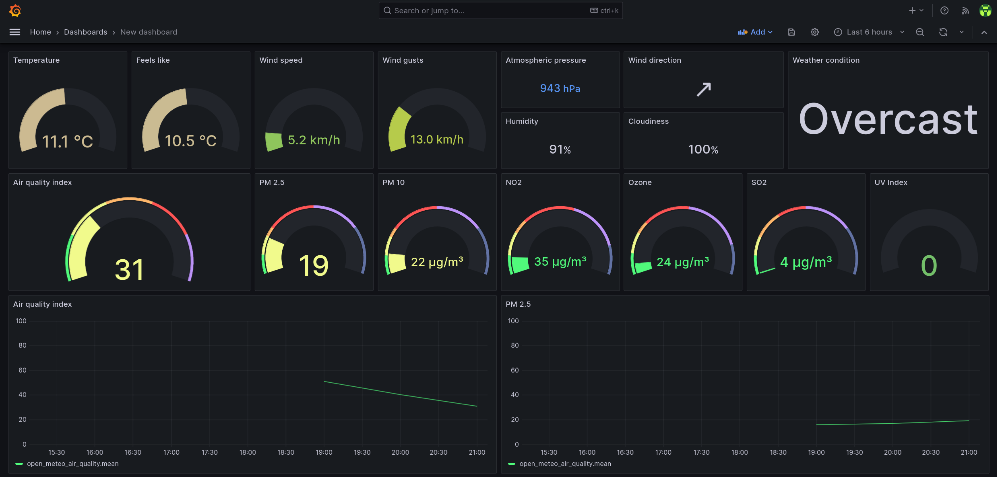

# open-meteo-exporter

Bash script that uploads the current air quality and weather data from the Open-Meteo API to influxdb on an hourly basis

# I no longer use this so development of this tool has ceased. Feel free to fork it

If using telegraf + influxdb the same outcome can be achieved via `input.http` [plugin](https://github.com/influxdata/telegraf/tree/master/plugins/inputs/http) + `json_v2` [parser](https://github.com/influxdata/telegraf/tree/master/plugins/parsers/json_v2) with the following config (just need to set the correct latitude/longitude in the URL query parameter):

```ini
[[inputs.http]]
  name_override = "open_meteo_air_quality"
  interval = "5m"
  startup_error_behavior = "retry"
  urls = [
    "https://air-quality-api.open-meteo.com/v1/air-quality?timeformat=unixtime&latitude=$LATITUDE&longitude=$LONGITUDE&current=european_aqi,us_aqi,pm10,pm2_5,carbon_monoxide,nitrogen_dioxide,sulphur_dioxide,ozone,aerosol_optical_depth,dust,uv_index,uv_index_clear_sky"
  ]
  data_format = "json_v2"
  [[inputs.http.json_v2]]
        [[inputs.http.json_v2.object]]
            path = "current"
            disable_prepend_keys = true

[[inputs.http]]
  name_override = "open_meteo_current_weather"
  interval = "5m"
  startup_error_behavior = "retry"
  urls = [
    "https://api.open-meteo.com/v1/forecast?timeformat=unixtime&latitude=$LATITUDE&longitude=$LONGITUDE&current=temperature_2m,relative_humidity_2m,apparent_temperature,precipitation,rain,showers,snowfall,weather_code,cloud_cover,pressure_msl,surface_pressure,wind_speed_10m,wind_direction_10m,wind_gusts_10m"
  ]
  data_format = "json_v2"
  [[inputs.http.json_v2]]
        [[inputs.http.json_v2.object]]
            path = "current"
            disable_prepend_keys = true
```

## Dependencies

- [awk](https://www.gnu.org/software/gawk/manual/gawk.html)
- [bash](https://www.gnu.org/software/bash/)
- [curl](https://curl.se/)
- [gzip](https://www.gnu.org/software/gzip/)
- [influxdb v2+](https://docs.influxdata.com/influxdb/v2.6/)
- [jq](https://stedolan.github.io/jq/)
- [systemd](https://systemd.io/)
- Optional:
  - [make](https://www.gnu.org/software/make/) - for automatic installation support
  - [docker](https://docs.docker.com/)

## Relevant documentation

- [Open-Meteo API](https://open-meteo.com/en/docs)
- [InfluxDB API](https://docs.influxdata.com/influxdb/v2.6/write-data/developer-tools/api/)
- [Systemd Timers](https://www.freedesktop.org/software/systemd/man/systemd.timer.html)
- [compose-scheduler](https://github.com/reddec/compose-scheduler)

## Installation

### With Docker

#### docker-compose

1. Configure `open_meteo_exporter.conf` (see the configuration section below).
1. Run it.

   ```bash
   docker compose up --detach
   ```

#### docker build & run

1. Build the docker image.

   ```bash
   docker build . --tag open-meteo-exporter
   ```

1. Configure `open_meteo_exporter.conf` (see the configuration section below).
1. Run it.

   ```bash
    docker run --rm --init --tty --interactive --read-only --cap-drop ALL --security-opt no-new-privileges:true --cpus 2 -m 64m --pids-limit 16 --volume ./open_meteo_exporter.conf:/app/open_meteo_exporter.conf:ro ghcr.io/rare-magma/open-meteo-exporter:latest
    ```

### With the Makefile

For convenience, you can install this exporter with the following command or follow the manual process described in the next paragraph.

```bash
make install
$EDITOR $HOME/.config/open_meteo_exporter.conf
```

### Manually

1. Copy `open_meteo_exporter.sh` to `$HOME/.local/bin/` and make it executable.

2. Copy `open_meteo_exporter.conf` to `$HOME/.config/`, configure it (see the configuration section below) and make it read only.

3. Copy the systemd unit and timer to `$HOME/.config/systemd/user/`:

```bash
cp open-meteo-exporter.* $HOME/.config/systemd/user/
```

4. and run the following command to activate the timer:

```bash
systemctl --user enable --now open-meteo-exporter.timer
```

It's possible to trigger the execution by running manually:

```bash
systemctl --user start open-meteo-exporter.service
```

### Config file

The config file has a few options:

```bash
INFLUXDB_HOST='influxdb.example.com'
INFLUXDB_API_TOKEN='ZXhhbXBsZXRva2VuZXhhcXdzZGFzZGptcW9kcXdvZGptcXdvZHF3b2RqbXF3ZHFhc2RhCg=='
ORG='home'
BUCKET='openmeteo'
LONGITUDE='1.23456'
LATITUDE='1.23456'
```

- `INFLUXDB_HOST` should be the FQDN of the influxdb server.
- `ORG` should be the name of the influxdb organization that contains the data bucket defined below.
- `BUCKET` should be the name of the influxdb bucket that will hold the data.
- `INFLUXDB_API_TOKEN` should be the influxdb API token value.
  - This token should have write access to the `BUCKET` defined above.
- `LONGITUDE` should be the longitude in numerical value of the location to collect data for.
- `LATITUDE` should be the latitude in numerical value of the location to collect data for.

## Troubleshooting

Run the script manually with bash set to trace:

```bash
bash -x $HOME/.local/bin/open_meteo_exporter.sh
```

Check the systemd service logs and timer info with:

```bash
journalctl --user --unit open-meteo-exporter.service
systemctl --user list-timers
```

## Exported metrics for each hour (in the GMT timezone)

### Air quality

- european_aqi: `EAQI`
- us_aqi: `USAQI`
- pm10: `μg/m³`
- pm2_5: `μg/m³`
- carbon_monoxide: `μg/m³`
- nitrogen_dioxide: `μg/m³`
- sulphur_dioxide: `μg/m³`
- ozone: `μg/m³`
- aerosol_optical_depth: `ratio from 0 to 1`
- dust: `μg/m³`
- uv_index: `number`
- uv_index_clear_sky: `number`

### Weather conditions

- temperature_2m: `°C`
- relative_humidity_2m: `%`
- apparent_temperature: `°C`
- precipitation: `mm`
- rain: `mm`
- showers: `mm`
- snowfall: `cm`
- weather_code: `wmo code`
- cloud_cover: `%`
- pressure_msl: `hPa`
- surface_pressure: `hPa`
- wind_speed_10m: `km/h`
- wind_direction_10m: `°`
- wind_gusts_10m: `km/h`

## Exported metrics example

```bash
open_meteo_air_quality,longitude=1.23456,latitude=1.23456 european_aqi=50,us_aqi=61,pm10=43.4,pm2_5=15.7,carbon_monoxide=145.0,nitrogen_dioxide=0.1,sulphur_dioxide=0.4,ozone=53.0,aerosol_optical_depth=0.19,dust=45.0,uv_index=0.00,uv_index_clear_sky=0.00 1702227600
open_meteo_current_weather,longitude=1.23456,latitude=1.23456 temperature_2m=28.5,relative_humidity_2m=80,apparent_temperature=32.3,precipitation=0.00,rain=0.00,showers=0.00,snowfall=0.00,weather_code=2,cloud_cover=52,pressure_msl=1011.9,surface_pressure=1011.9,wind_speed_10m=19.5,wind_direction_10m=65,wind_gusts_10m=24.5 1702233900
```

## Example grafana dashboard

In `open-meteo-dashboard.json` there is an example of the kind of dashboard that can be built with `open-meteo-exporter` data:



Import it by doing the following:

1. Create a dashboard
2. Click the dashboard's settings button on the top right.
3. Go to JSON Model and then paste there the content of the `open-meteo-dashboard.json` file.

## Uninstallation

### With the Makefile

For convenience, you can uninstall this exporter with the following command or follow the process described in the next paragraph.

```bash
make uninstall
```

### Manually

Run the following command to deactivate the timer:

```bash
systemctl --user disable --now open-meteo-exporter.timer
```

Delete the following files:

```bash
~/.local/bin/open_meteo_exporter.sh
~/.config/open_meteo_exporter.conf
~/.config/systemd/user/open-meteo-exporter.timer
~/.config/systemd/user/open-meteo-exporter.service
```

## Credits

- [Open-Meteo](https://open-meteo.com/)
- [reddec/compose-scheduler](https://github.com/reddec/compose-scheduler)

This project takes inspiration from the following:

- [rare-magma/pbs-exporter](https://github.com/rare-magma/pbs-exporter)
- [mad-ady/prometheus-borg-exporter](https://github.com/mad-ady/prometheus-borg-exporter)
- [OVYA/prometheus-borg-exporter](https://github.com/OVYA/prometheus-borg-exporter)
